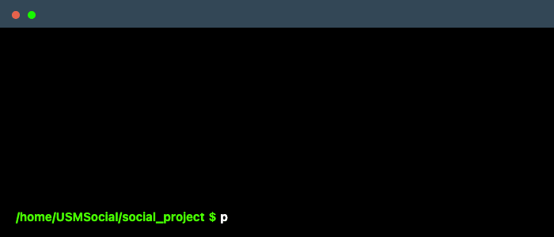

# Huskies :wolf: (Authors)
 - [Jere Perisic](https://github.com/PerisicJere)
 - [Evan Sawyer](https://github.com/Evanmsawyer)
 - [Corey Reinholdtsen](https://github.com/CjamesR10)
 - [Anusha Ghimire](https://github.com/anu-sha19)
## Special Thanks 
We want to thank [Dr. Song](https://yuqi-song.github.io/) for allowing us to work on this project. 

## Features

- User authentication, registration, and login
- Edit profile and update profile picture
- Post posts, make groups, join groups
- User feed displays posts from followed users
- Ability to follow users
- Chat room
- Search users
- Make events
- Interact with posts (like, comment)
- Delete posts and comments

## Usage

- #### Make migrations and run the server

## Demo 
- USM Social feature demo
----
### Login

----
### Profile and Posts

----

### Events

----

### Groups

----

### Follow users

----

### Additional details

- This project is part of a software engineering course at [University of Southern Maine](https://usm.maine.edu/)
